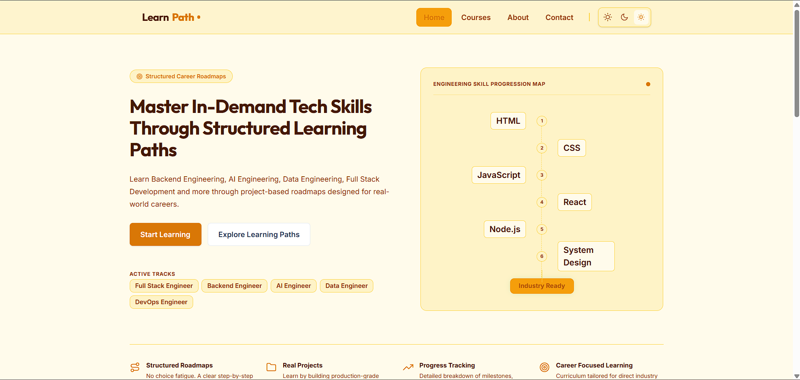
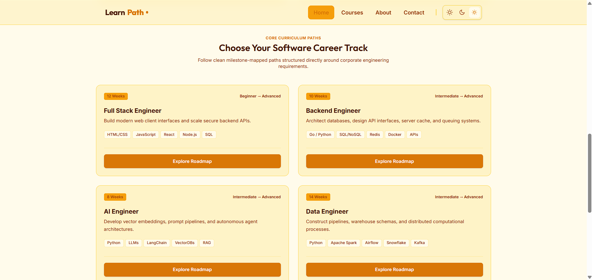
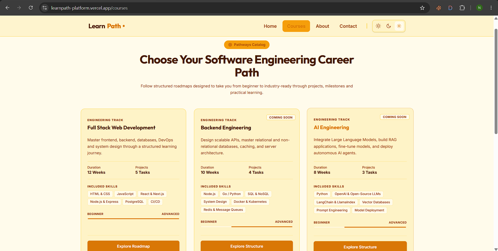
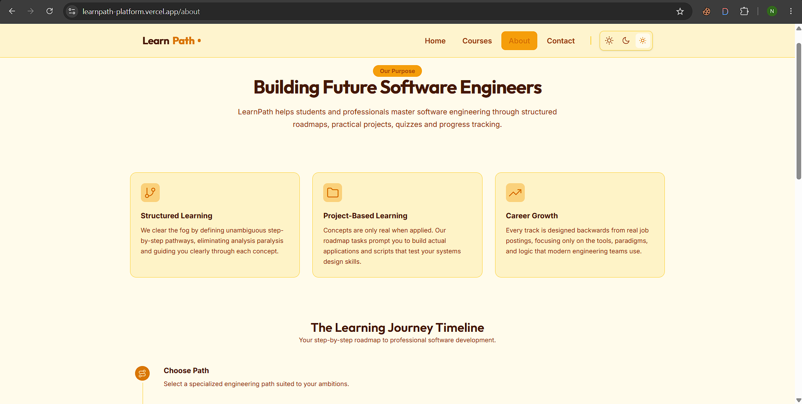
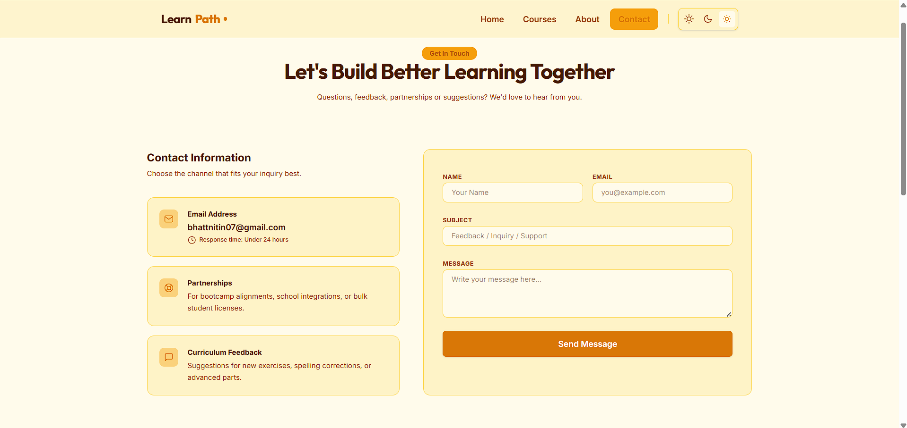

# LearnPath

LearnPath is a structured software engineering learning platform that helps aspiring developers follow clear career roadmaps, build practical projects, and develop industry-relevant skills through guided learning paths.

## Live Demo

https://learnpath-platform.vercel.app

## Repository

https://github.com/Nitin-bhatt46/learnpath-platform

---

## Overview

LearnPath was developed to address one of the most common challenges faced by aspiring software engineers: information overload and lack of direction.

Instead of navigating countless tutorials and disconnected resources, learners can follow structured, career-oriented roadmaps designed around real-world engineering roles. The platform provides guided pathways, project-based learning, and progress tracking to help users move from beginner to industry-ready.

The platform currently includes learning tracks for:

* Full Stack Engineering
* Backend Engineering
* AI Engineering
* Data Engineering
* DevOps Engineering

---

## Features

### Structured Learning Roadmaps

Career-focused learning paths designed to provide a clear progression from foundational concepts to advanced engineering topics.

### Project-Based Learning

Hands-on projects that reinforce technical concepts through practical implementation and real-world scenarios.

### Progress Tracking

Visual milestones and structured learning stages to help users monitor their development.

### Career-Oriented Curriculum

Roadmaps designed around modern industry requirements and engineering best practices.

### AI Learning Support

Integrated concept-based assistance for understanding complex software engineering topics.

### Responsive Design

Optimized user experience across desktop, tablet, and mobile devices.

### Theme Switching

Light and dark mode support for improved accessibility and user preference.

---

## Learning Tracks

### Full Stack Engineer

* HTML
* CSS
* JavaScript
* React
* Node.js
* SQL

### Backend Engineer

* Go
* Python
* API Development
* SQL & NoSQL Databases
* Redis
* Docker

### AI Engineer

* Python
* Large Language Models (LLMs)
* LangChain
* Retrieval-Augmented Generation (RAG)
* Vector Databases

### Data Engineer

* Python
* Apache Spark
* Airflow
* Kafka
* Snowflake

### DevOps Engineer

* Linux
* Kubernetes
* Terraform
* CI/CD
* AWS

---

## Screenshots

### Home Page



### Career Tracks



### Courses Page



### About Page



### Contact Page



---

## Technology Stack

### Frontend

* Next.js
* React
* TypeScript
* Tailwind CSS

### Deployment

* Vercel

> Update this section if additional technologies were used.

---

## Installation

Clone the repository:

```bash
git clone https://github.com/Nitin-bhatt46/learnpath-platform.git
```

Navigate to the project directory:

```bash
cd learnpath-platform
```

Install dependencies:

```bash
npm install
```

Run the development server:

```bash
npm run dev
```

Open your browser and visit:

```text
http://localhost:3000
```

---

## Project Structure

```text
src/
├── app/
├── components/
├── pages/
├── styles/
├── assets/
└── utils/
```

---

## Future Enhancements

* User authentication and authorization
* Personalized dashboards
* Persistent progress tracking
* Interactive quizzes and assessments
* Certification system
* AI-powered mentoring assistant
* Learning analytics dashboard
* Community discussion features

---

## Motivation

LearnPath was built as my first hackathon project with the goal of simplifying the learning journey for aspiring software engineers. The project focuses on providing structured, practical, and career-oriented educational pathways that help learners stay focused and build relevant skills efficiently.

---

## Author

**Nitin Bhatt**

GitHub: https://github.com/Nitin-bhatt46

Project Repository: https://github.com/Nitin-bhatt46/learnpath-platform

---

## License

This project is licensed under the MIT License.
